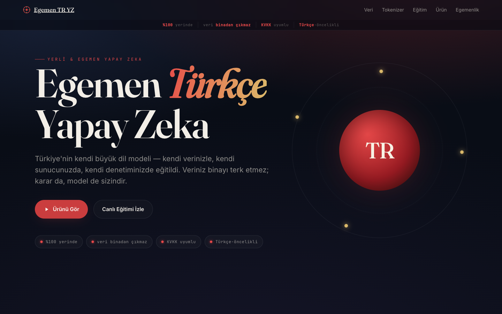
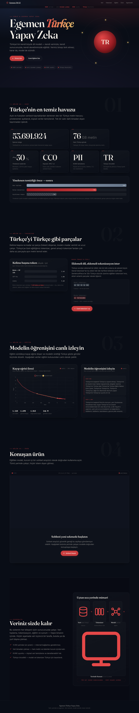

<div align="center">

# 🇹🇷 Turkish LLM Demo — *Egemen Türkçe Yapay Zeka*

**A fully on-premise, end-to-end demonstration of a sovereign Turkish language model** — a from-scratch ~110M-parameter transformer trained *live* on a self-built 39-billion-token Turkish corpus, a QLoRA Turkish chat assistant, a tokenizer-efficiency visualizer, and an executive narrative dashboard — all running on a single 8 GB GPU, with the data never leaving the building.

[](https://github.com/BerkayRA/turkish-llm-demo/actions/workflows/ci.yml)
[](LICENSE)


<br />



<sub><i>The executive dashboard (Turkish): a guided walkthrough of data → tokenizer → live training → product, framed around on-prem data sovereignty.</i></sub>

</div>

---

## What this is

This repository is the **capstone demo** of a four-repository effort to build a Turkish LLM *from the data up* — not a fine-tune of someone else's model, but the whole stack: tokenizer, corpus, training code, and serving. It is designed to be walked through top-to-bottom in five minutes by a non-technical stakeholder, while every layer underneath is real, reproducible engineering.

The central claim it demonstrates: **a competent Turkish model can be built and operated entirely on-premise, on modest hardware, on data you control** — which matters for KVKK/GDPR-style data-sovereignty requirements where sending Turkish corporate or citizen data to a third-party API is a non-starter.

It ships **four components**, each independently runnable:

| # | Component | What it proves | Stack |
|---|-----------|----------------|-------|
| 1 | [`train/`](train/) — **from-scratch model** | We can train a real transformer on our own data + tokenizer on one 8 GB GPU | PyTorch, nanoGPT-style loop, Llama-arch decoder |
| 2 | [`chatbot/`](chatbot/) — **Turkish chat assistant** | A polished, interactive Turkish product, served locally | QLoRA (Qwen2.5-3B) → GGUF → Ollama |
| 3 | [`tokenizer_viz/`](tokenizer_viz/) — **tokenizer visualizer** | Our Turkish tokenizer is **~40% more efficient** than GPT-4o / Llama-3 on Turkish | Gradio, SentencePiece, tiktoken |
| 4 | [`dashboard/`](dashboard/) — **executive dashboard** | The whole journey — data → tokenizer → training → product — as one guided story | Static HTML/CSS/vanilla JS + Chart.js |

---

## By the numbers

| | |
|---|---|
| **Corpus** | 53,691,924 deduplicated Turkish documents (~30% duplicates removed) |
| **Source** | HPLT v2 cleaned Turkish (CC0), ~172 GB raw parquet |
| **Tokens** | ~38.9 B train + ~0.2 B validation ≈ **39 B tokens** (uint16 shards) |
| **Tokenizer** | SentencePiece Unigram, 32,000 vocab, byte-fallback (`sp_unigram_32000`) |
| **Model** | Llama-style decoder · 12 layers · 768 dim · RMSNorm · SwiGLU · RoPE · tied embeddings · **109,529,856 params** |
| **Training** | single **NVIDIA Quadro RTX 4000** (8 GB, Turing sm_75) · bf16/fp16 AMP · grad-checkpointing · ~131 K tokens/step |
| **Tokenizer efficiency** | ~2.4 tokens/word (ours) vs ~4.0 (GPT-4o `o200k_base`) vs ~5.6 (Llama-3) on Turkish |

> Numbers reflect the live demo configuration. The training run is ongoing; the dashboard streams its loss curve and sample generations in real time.

📄 **Deep dives:** [**The Model**](docs/MODEL.md) (the from-scratch model — what it is and how it was built) · [**The Chatbot**](docs/CHATBOT.md) (what the fine-tune is and isn't, what's ours, and QLoRA explained) — plain-language but technical, for engineers, colleagues, and investors.

---

## The repository family — how the pieces connect

`turkish-llm-demo` doesn't stand alone. It is the **integration and showcase layer** on top of three upstream repositories, each solving one part of the problem. The core thesis across all four: **Turkish is agglutinative, so generic English-tuned tokenizers fragment it badly — build the tokenizer and corpus *first*, then you don't waste compute training a model on inflated per-token costs.**

```
┌─────────────────────────┐
│   turkish-tokenizer     │  Zero-dependency morphological analyzer.
│   (morphology engine)   │  Segments words → root + ordered morphemes
└───────────┬─────────────┘  (UD-IMST aligned). Ships tr_fertility.py.
            │  morphological analysis + fertility methodology
            ▼
┌─────────────────────────┐
│      turkish-llm        │  Trains & evaluates tokenizers (SentencePiece
│  (tokenizer + arch lab) │  unigram, morpheme-BPE). Defines the Llama
└───────────┬─────────────┘  decoder spec (EXPERIMENT_AB) + sp_unigram_32000.
            │  sp_unigram_32000.model  +  model architecture spec
            ▼
┌─────────────────────────┐
│     turkish-corpus      │  datatrove pipeline: ingest HPLT, Turkish-aware
│   (data pipeline)       │  cleaning (ı/İ casing, KVKK PII scrub), MinHash
└───────────┬─────────────┘  dedup. Produces the token-counted blend.
            │  53.7M deduped docs → ~39B uint16 tokens
            ▼
┌─────────────────────────┐
│  ►  turkish-llm-demo  ◄  │  THIS REPO. Trains the model live on the corpus,
│  (integration + demo)   │  serves a Turkish chatbot, visualizes the
└─────────────────────────┘  tokenizer win, and tells the story to an exec.
```

**Concrete data/artifact flow:**

1. **`turkish-tokenizer`** → provides the morphological analyzer and the `fertility` metric methodology that the tokenizer visualizer (component 3) is built on.
2. **`turkish-llm`** → trains and exports `sp_unigram_32000.model` (the tokenizer this demo tokenizes and trains with) **and** specifies the Llama decoder that [`train/model.py`](train/model.py) implements (`docs/EXPERIMENT_AB.md`, Config A).
3. **`turkish-corpus`** → the datatrove pipeline that turns raw HPLT into the **53.7 M-doc / 39 B-token** corpus that [`train/data.py`](train/data.py) memmaps as `.bin` shards.
4. **`turkish-llm-demo`** *(here)* → consumes all of the above to train the model on a live GPU, serve the chatbot, and present the unified narrative.

| Repo | Role | Link |
|------|------|------|
| `turkish-tokenizer` | Morphological analyzer + fertility analyzer (pure Python, zero deps) | https://github.com/BerkayRA/turkish-tokenizer |
| `turkish-llm` | Tokenizer training/eval lab + model architecture spec | https://github.com/BerkayRA/turkish-llm |
| `turkish-corpus` | HPLT-anchored Turkish corpus pipeline (clean + dedup + blend) | https://github.com/BerkayRA/turkish-corpus |
| **`turkish-llm-demo`** | **End-to-end on-prem demo (this repo)** | — |

---

## Architecture at a glance

```
                          ┌───────────────────────────────────────────┐
                          │        dashboard/  (static, :8080)         │
                          │  Veri → Tokenizer → Eğitim → Ürün story     │
                          │  reads live train_log.jsonl / samples.jsonl │
                          └───────┬───────────────┬───────────────┬────┘
                  embeds /        │ iframe        │ live fetch    │ link
                  links           ▼               ▼               ▼
              ┌─────────────────────┐  ┌────────────────────┐  ┌──────────────────┐
              │ tokenizer_viz/ :7860 │  │  train/  (GPU job) │  │  chatbot/ :11435 │
              │ Gradio · 3-way diff  │  │  ~110M Llama, bf16 │  │  Ollama + QLoRA   │
              │ ours vs GPT-4o/Llama │  │  writes JSONL logs │  │  Qwen2.5-3B (TR)  │
              └─────────────────────┘  └────────────────────┘  └──────────────────┘
                                                ▲
                                                │ memmap uint16 .bin shards
                                   ┌────────────┴─────────────┐
                                   │  ~39B-token corpus +      │
                                   │  sp_unigram_32000.model   │  ◄ from sibling repos
                                   └───────────────────────────┘
```

Everything runs on the **same on-prem box**, LAN-exposed. The literal proof of the sovereignty claim: **the dashboard still works with the external network unplugged.**

<details>
<summary><b>📊 See the full narrative dashboard (one scroll, top to bottom)</b></summary>

<br />



<sub><i>Veri (53.7M docs) → Tokenizer (fertility win) → Eğitim (live loss curve + sample stream) → Ürün (chatbot) → Egemenlik (on-prem framing). The training section streams real <code>train_log.jsonl</code> data.</i></sub>

</details>

---

## Quickstart

Each component is self-contained — see its own README for full detail. Minimal paths:

### Dashboard (no GPU, runs anywhere)
```bash
cd dashboard
python -m http.server 8080
# open http://localhost:8080  — ships with sample_data/ fixtures, so it's fully
# populated before any real training exists. Point config.js at a live box later.
```

### Tokenizer visualizer
```bash
cd tokenizer_viz
python -m venv .venv && source .venv/bin/activate
pip install -r requirements.txt
export OUR_SP_MODEL=/path/to/sp_unigram_32000.model   # from the turkish-llm repo
python app.py        # http://localhost:7860
```

### From-scratch training (needs a CUDA GPU)
```bash
cd train
python -m venv .venv && source .venv/bin/activate
pip install -r requirements.txt
pip install torch --index-url https://download.pytorch.org/whl/cu124
python train.py \
  --data_dir /path/to/tokens --out_dir runs/u32_124m \
  --model 124m --block_size 1024 \
  --batch_size 8 --grad_accum 16 --grad_checkpoint \
  --ckpt_every 250 --sp_model /path/to/sp_unigram_32000.model
```

### Turkish chatbot (QLoRA → Ollama)
```bash
cd chatbot
pip install torch --index-url https://download.pytorch.org/whl/cu124
pip install -r requirements.txt
python prepare_data.py --offline --out data/train.jsonl   # CC0 offline fallback
python finetune_qlora.py --dataset data/train.jsonl --out_dir out/turkce-asistan-lora
python merge_and_export.py --adapter_dir out/turkce-asistan-lora --model_name turkce-asistan
# then: ollama create turkce-asistan -f Modelfile
```

---

## Engineering notes worth calling out

- **Fitting 110M training onto 8 GB.** The fp32 cross-entropy logits tensor (`batch × seq × 32000 × 4 B ≈ 1 GB`) is the real VRAM ceiling, not the weights. The solution is small micro-batches + gradient accumulation + gradient checkpointing to keep ~131 K tokens/step while staying under 8 GB. See [`train/README.md`](train/README.md).
- **Turing dtype correctness.** Turing (sm_75) has no bf16 tensor cores; RoPE and RMSNorm must cast carefully or fp16 autocast crashes. The model code handles this explicitly.
- **Durable checkpointing.** Training checkpoints every 250 steps so a long multi-day run survives interruptions without losing more than a few minutes.
- **Tokenizer as a measurable win, not a vibe.** The visualizer quantifies fertility (tokens/word) side-by-side — agglutinative Turkish is where a purpose-built tokenizer pays off, and the demo makes that ~40% reduction visible.
- **Honest licensing.** The chatbot's default SFT dataset is flagged research-only (distilled from proprietary models); an original, hand-written CC0 offline fallback is included for unencumbered use.
- **Graceful degradation everywhere.** Dashboard falls back to sample fixtures and shows a "waiting for data" state; tokenizer viz falls back to a proxy tokenizer if a model isn't locally available; chat falls back to a launch button if iframe embedding is blocked.

---

## Status

🟢 **Training is live.** The ~110M model is training on a single RTX 4000; the dashboard streams its loss curve and "watch it learn" sample generations. The chatbot, tokenizer visualizer, and dashboard are deployed and reachable on the on-prem box.

The bespoke QLoRA chat fine-tune is staged and runs when the GPU is free (single 8 GB card can't train the from-scratch model and serve a 3B chat model simultaneously).

---

## Author

**Berkay Adanalı** — [@BerkayRA](https://github.com/BerkayRA) · b.adanali@gmail.com

Part of the Turkish-LLM project family: [turkish-tokenizer](https://github.com/BerkayRA/turkish-tokenizer) · [turkish-llm](https://github.com/BerkayRA/turkish-llm) · [turkish-corpus](https://github.com/BerkayRA/turkish-corpus) · **turkish-llm-demo**.

## License

[MIT](LICENSE) © 2026 Berkay Adanalı. Component datasets and base models carry their own licenses — see each component's README before any commercial use.
